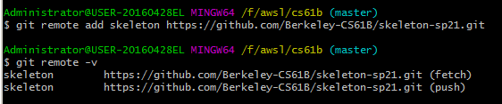
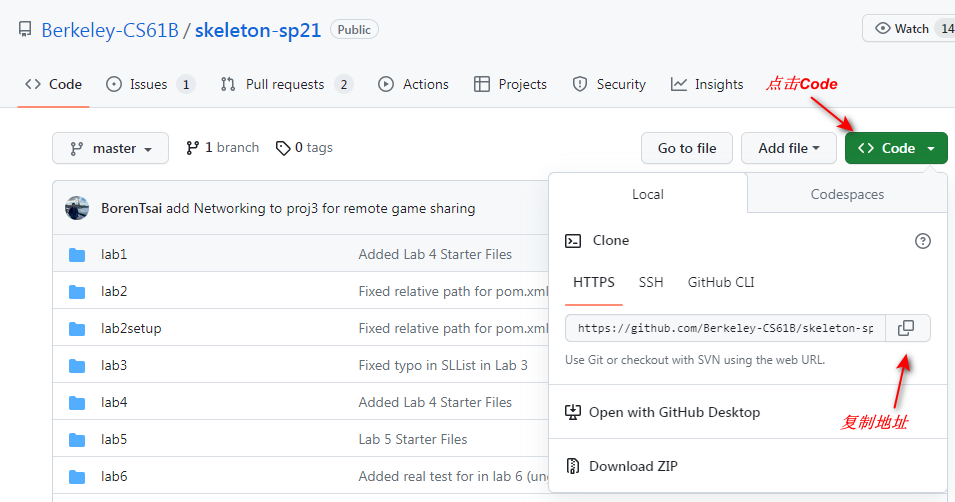
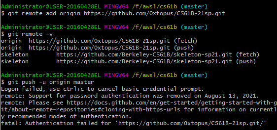
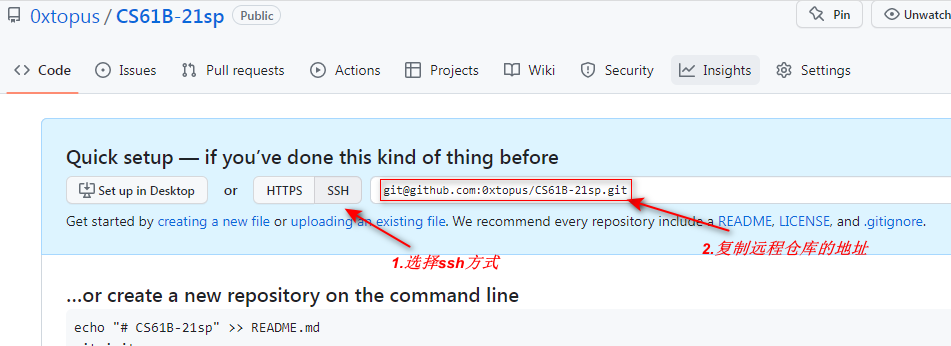
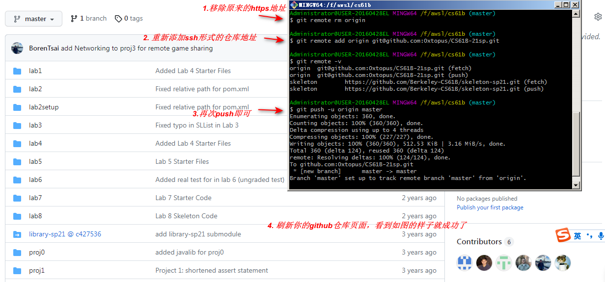
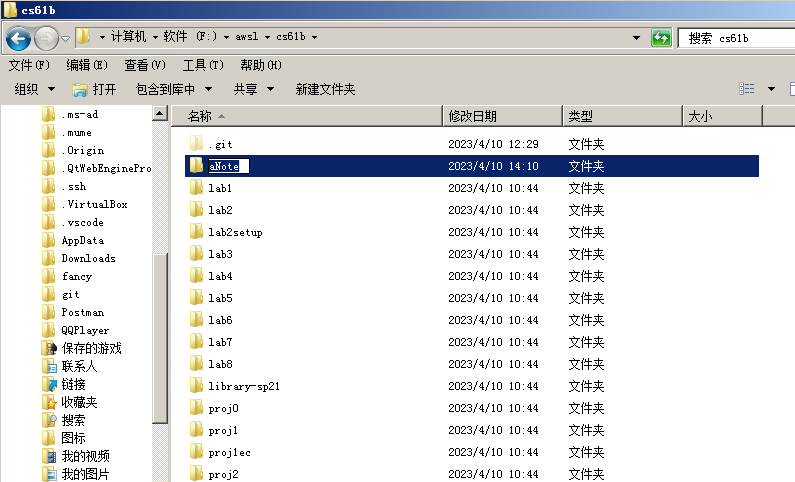

# Navigating CS61B: Get Started in 2023

- [Navigating CS61B: Get Started in 2023](#navigating-cs61b-get-started-in-2023-1)
  - [简介](#简介)
  - [基本信息](#基本信息)
    - [课程结构](#课程结构)
    - [前置知识](#前置知识)
  - [开始学习](#开始学习)
    - [学习策略](#学习策略)
    - [注册Autograder](#注册autograder)
    - [配置Github](#配置github)
    - [vsCode tips](#vscode-tips)
    - [Project 3 Bear Maps的一些设置](#project-3-bear-maps的一些设置)
      - [library的更新](#library的更新)
      - [Intellij的设置](#intellij的设置)
  - [资源和方法](#资源和方法)
    - [插件](#插件)
      - [Intellij](#intellij)
      - [vsCode](#vscode)
      - [Chrome](#chrome)
      - [其他软件](#其他软件)
    - [学习方法](#学习方法)
    - [附加资源](#附加资源)
  - [致谢](#致谢)


## 简介

您好！我在2023年的2月~4月间自学了CS61B这门课程。由于课程版本众多，而且对公众开放的自动评分系统（autograder）所对应的学期比较古早，加上自学时的配置环境较学期进行时有所不同，踩了不少坑。因此写了这篇指南，希望能派上用场! 

## 基本信息

### 课程结构

本课程的正式名称是CS61B，主要在每年的春季和秋季开设，教授Java基础、编程技巧和数据结构与算法。根据[2018年春季学期的教学安排](https://docs.google.com/presentation/d/12Fp-hjYhdFL7EcVqpNGpFb2BdCL2gr1SFOS5E6pyohg/edit#slide=id.g821245c8d_0_40)来看，课程前4周主要教授Java基础，而4\~8周围绕高级编程技巧（Advanced Programming）展开，最后的8~14周围绕数据结构与算法展开。这门课还有一个更偏向于实验的夏季版本CS61BL，根据这篇[帖子](https://www.reddit.com/r/berkeley/comments/eqyr6q/cs61b_vs_cs61bl_whats_the_difference_and_which_do/?rdt=52945), 可知二者基本差不多，并没有实质上的内容差异，可以放心食用。目前对公众开放的自动评分系统（autograder）有两套：分别是2018年和2021年的版本。我做的lab和homework以及project都是基于[2018年春季](https://sp18.datastructur.es/)的版本，您可以直接在搜素引擎搜索`CS61B + 年份 + 季节`进入各学期的官网来查看各版本的差别。课程的更多详细信息可以参见[这里](https://www2.eecs.berkeley.edu/Courses/CS61B/)。

### 前置知识

- 编程基础：至少学过一门编程语言即可。如果您没有任何基础，您可以先学习它的前置课程CS61A。我在学习这门课之前只会基础的C语言和一点点肤浅的JavaScript，也没有上过CS61A，在整个流程中却并没有遇到太大的困难。虽然这门课以Java为核心语言，但课程的前4周会让您建立超级扎实的Java基础，所以无需担心。
- 英语：这门课对英语的阅读和听力有一定的要求。
  - 听力：您可以根据自己的能力使用机翻字幕或英文字幕以及一些软件或插件来帮助理解。大多数视频都会有字幕，不过还是有极少数视频没有字幕（我记得后期有一个视频的字幕被识别成荷兰文了233），但总体影响不大。我个人习惯直接听，然后使用Language Reactor插件来看字幕里不认识的单词以及核对没太听懂的重要部分。有的时候还是蛮经常需要倒回头重看的，不过听到后期习惯以后情况就会好些。
  - 阅读：有时候会涉及到一些课堂上提及的专业词汇和一些常见词的特殊专业用法（比如Hashing里的bucket），建议可以找个什么地方记录一下特殊词汇，做一个词汇表方便检索。还有就是作业和练习的说明有的时候会比较冗长（特别是大项目），需要有一定的耐心去理解，如果读完一段还不太清楚要干什么，可以继续往下看。有的时候最后的Q/A部分也可能会有所帮助。我一般记不太住的时候会拿草稿本把要点记一下来理清思路，然后把把握不准的句子让翻译软件或者AI帮我翻译核对一下。

总之，如果您不太确定自己是否适合这门课程，您可以直接打开<a href="https://joshhug.gitbooks.io/hug61b/content/chap1/chap11.html">第一节课的课程书</a>，完整地把里面的视频和内容看一遍，然后根据自己的情况做出判断（我在使用课程书的时候有时会出现unauthorized的情况，需要科学上网解决）。

## 开始学习

好了！如果您已经下定决心，要认认真真把CS61B完整地学习一遍，那么下面的内容可能将对您有所帮助！Let's go！

### 学习策略

<a href="https://sp18.datastructur.es/">课程主页</a>的表格已经按周为单位把各周的任务和deadline写的很清楚了。我一般先从Reading部分开始，把配套的书和里面内嵌的视频看完，然后根据Lecture的guide部分（或者slide部分）总结一下笔记。Discussion部分一般是课后的练习，对提高理论知识和加深理解比较有帮助。Discussion也都有提供答案。Lab，HW和Project就是写代码的实践部分了,当然是多多益善，做越多越好，您可以根据自己的情况自行安排。(我的情况是跳过了project2 和 hw5，以及期末的makeup的练习，以及一些需要Peer review才能完成的内容，其余都完成了)。

注意，这门课程的Reading部分已经有更新的版本了。打开23年春季的61B主页，你会发现课程的前三周使用的还是<a href="https://joshhug.gitbooks.io/hug61b/content/">旧版Reading</a>, 但后期就换成<a href="https://cs61b-2.gitbook.io/cs61b-textbook/">新版</a>了，再后期还有一本叫`Algs`的书让你自己阅读。

我的建议是：在前期用旧版Reading，因为新版没有一些前期的内容，比如List之类的。这门课程的视频有两类：一些是专门为网络学习录的短视频，学起来时长更短；还有一些是没有专门录制，就直接是线下上课整节课的录屏，比较长。到后期有一些内容新版书的质量明显好于旧版，而且新版书也有更多的短视频，所以当您发现旧版Reading不好用的时候，可以去参考一下新版。不过新旧Reading有一些课程顺序不太一样，可以自己灵活调制。在我写作本文的时候最最最后几节课的内容两本书都没有，我看了一下新版书应该是根据23sp学期的节奏更新的，4月底课程结束它应该能更新完。

后期有一些章节书里面没有视频，不知道后期是否会补录，要看视频的话您只能去lecture的video里面进行观看。

由于各个视频录制的时间不一，所以有的时候可能里面提到的一些lab或者项目其实是其他学期的，请注意看视频的发布时间，有的时候如果你需要上课视频提到的lecture code，可以去<a href="https://github.com/Berkeley-CS61B">CS61B官方github主页</a>找到对应的仓库，一般都会有。

`Algs`这本书指的是《算法(第四版)》这本书，你可以在<a href="http://aguo.us/cs61b/">CS61B Resources</a>,官方整理的资源集合里找到它的<a href="https://algs4.cs.princeton.edu/home/">在线英文版</a>。我没有用到这本书。

### 注册Autograder

做Lab1的时候，会让你设置本课程的<a href="https://www.gradescope.com/">自动评分系统</a>。我记得我自己注册的时候还是蛮顺利的，跟着<a href="https://sp18.datastructur.es/materials/lab/lab1/lab1#g-submitting-lab-1">官方的指南</a>加上<a href="https://csdiy.wiki/%E6%95%B0%E6%8D%AE%E7%BB%93%E6%9E%84%E4%B8%8E%E7%AE%97%E6%B3%95/CS61B/">CS自学指南</a>评论区里的一些提示就设置好了。如果您遇到了一些问题，可以参照<a href="https://docs.google.com/document/d/1lh1GyJfP4d99Kd2ubFWcHtzMgwW4M3aMDLqafMCGO7I/edit#heading=h.lvw3364bd98q">这个教程</a>(另一位大佬写的61b帮助文档)。

### 配置Github

做18春季学期(sp18)的<a href="https://sp18.datastructur.es/materials/lab/lab1/lab1#d-git--remote-repos">lab1</a>的时候会教你配置Github来使用课程的<a href="https://www.gradescope.com/">在线评分系统</a>。但是，lab1的说明针对的是伯克利学生的使用来解说的。如果我们要使用公开的评分系统，那么配置Github的过程会有一点点不一样。

（注：使用官方的<a href="https://www.gradescope.com/">在线评分系统</a><u>必须通过GitHub仓库提交</u>，用上传文件方式提交评分系统无法识别）

1. 假设你已经跟着课程lab1的指南一路操作，来到了<a href="https://sp18.datastructur.es/materials/lab/lab1/lab1#d-git--remote-repos">lab1的这个部分</a>；

2. 无视"Clone your Berkeley-CS61B-Student organization repository..."这个部分的内容并按下列说明操作：

3. 在本地新建一个文件夹，然后打开git的命令行窗口，如图所示：
   

4. 初始化仓库：在命令行窗口输入`git init`并回车

5. 输入 `git remote add skeleton https://github.com/Berkeley-CS61B/skeleton-sp18.git` 设置远程仓库skeleton为2018年春季的仓库地址。设置好后，执行`git remote -v`之后就能看见设置好的远程仓库，如图所示（图中使用sp21的仓库进行演示）：
    

  因为目前课程只有18春季和21春季的自动评分系统向公众开放，所以建议使用这两个学期的代码仓库之一。如果您想要拉取其他学期的skeleton,可以打开对应学学期的github仓库查看对应的地址，进行类似操作。进入某学期的仓库页面后查看仓库地址的操作如下：
  

6. 之后执行`git pull skeleton master`，把你刚刚命名为skeleton的课程远程仓库的master分支里的文件拉取到本地。

7. 到自己的github上建立一个新仓库;

8. 执行`git remote add origin <新仓库的地址>`把自己的远程仓库添加到git里；然后执行`git push -u origin master`把课程的文件上传到自己的远程仓库里（如果你根据github的提示把自己的远程仓库分支名改成了`main`，那么执行`git push -u origin main`）。

下图是示范。可以看到如果你把远程仓库地址设置为https形式的话有可能会报错。因此，请**使用SSH方式**设置远程仓库地址。如果您不了解如何设置github以使用SSH，可以参考<a href="https://www.cnblogs.com/yuqiliu/p/12551258.html">这个教程</a>。



设置好ssh后，到仓库页面得到ssh的地址：



如下图所示重新设置推送即可：



上面用到的命令如下：

```bash
git remote rm origin
git remote add origin <仓库的ssh地址>
git push -u origin master
```


**创建自己的笔记文件夹！**

在设置好之后，你可以在目录里创建一个自己的文件夹来存放笔记之类的文件！



编辑.gitignore文件，让Git不要忽略你的笔记，下图为示例：


### vsCode tips

课程官方推荐使用的编辑器是Intellij，但是如果你想使用vsCode的话，也是可以的，但有一些特定的任务还是需要使用Intellij来完成（比如我记得某个lab好像有一个变量在vsCode里会报错）。如何配置vsCode可以参考<a href="https://blog.csdn.net/li12ji34an/article/details/105821558">这篇博文</a>的相关部分。

### Project 3 Bear Maps的一些设置

#### library的更新

如果你和我一样，选择学习18春季的课程，那么在做到project3: Bear Maps的时候会需要你更新一下`library-sp18`这个文件夹。直接在命令行里切换进入到`library-sp18`文件夹里，运行`git pull origin master`即可。

#### Intellij的设置

这个项目我是使用Intellij来做的。我记得在Project 3 的配套说明视频里，初始化项目的时候有勾选一个`Import Maven projects automatically`的选项。由于Intellij 2022.3 这个版本与2018年课程所用的版本已经不太一样，在创建项目的时候已经没有这个选项了，所以你可以参考<a href="https://stackoverflow.com/questions/60759611/import-maven-projects-automatically-checkbox-dissapear-in-intellij-eap">这个post</a>来进行设置:

> By following ways you can Import `Maven` projects automatically:
>
> For `InteliJ IDEA 14` upwards:
>
> ```rust
> Click File -> Settings -> Build, Execution, Deployment -> Build Tools -> Maven -> Importing -> TICK "Import Maven projects automatically".
> ```
>
> For `InteliJ IDEA 2020` upwards:
>
> ```rust
> Click Settings -> Build, Execution, Deployment -> Build Tools -> TICK "Reload projects after changes in the build scripts" and "Any changes"
> ```

## 资源和方法

这里讲一些我自己学习时觉得好用的工具和方法，希望能帮助到你！

### 插件

#### Intellij

因为我大部分使用的是vsCode，所以没有在Intellij里使用除了官方提供的java visualizer和CS61b插件以外的其他插件。

不过官方的CS61B插件里有一个Style Checker功能非常好用，因为在自动评分系统里面，代码的style不合规范的话往往是要被扣分的。要使用style checker，你需要右键点击某个文件，然后在弹出的菜单里选择`Check Style`选项即可。官方的style规范指南在此： <a href="https://sp19.datastructur.es/materials/guides/style-guide.html">style guide</a> 

#### vsCode

1. Better Comments: 在注释开头加上特殊符号，就可以使用各种颜色的注释
2. Bracket Pair Colorization Toggler: 把不同的{}用颜色区分开
3. Markdown All in One: 允许你在窗口里编辑Markdown文档并预览，可以用来写笔记
4. ChatGPT - EasyCode：允许你在窗口里使用AI交互

我大部分的课程任务都是用vsCode完成的，不过好像也没有用到很多插件，而且vsCode里没有Java Visualizer，比较遗憾。

#### Chrome

浏览器插件也可以让您如虎添翼，学习更上一层楼。下面是我在学习过程中使用的一些插件：

1. Language Reactor: 一个优化字幕体验的插件，可以点击查词还蛮不错的。现在好像也有可以用AI翻译的插件了，大家可以自己探索一下，说不定会有更好的发现。
2. AdBlock: 广告拦截插件
3. ChatHub: 允许你同时使用new bing和chatGPT
4. ChatGPT Sidebar: 允许你在侧边栏使用AI完成划词翻译，划词解释等功能。

#### 其他软件

1. Typora，或者任意一个能够写Markdown的地方，用来记笔记。
2. FastStone Capture， 或者一款好用的截图软件，把视频里的重点截图下来，做笔记的时候用，剪裁，添加文字标记什么的很方便。或者把没听懂的地方截下来，之后倒回去再听。
3. <a href="https://poe.com">Poe</a>：一个网页，有点像ChatHub，不过集成了更多AI。

### 学习方法

这里是我在学习时的一些技巧和方法，希望对您有用：

1. 使用AI来助你一臂之力！让AI帮你把代码全部写出来肯定不太好，但我们可以让它在一些小事上帮大忙，包括但不局限于：
   - 给变量起名；
   - 让AI解释一些自己还不是很清楚的概念，或者让它给出一些代码示例（比如问它怎么用Comparator）；
   - 在<u>独立完成</u>任务后让AI指出你代码写的不好的地方，学习改进自己的代码风格；
   - 让它帮忙总结或者修改笔记（你可以借鉴一下3月OpenAI的发布会，让AI写一些很炫酷(但不实用)的总结，比如：B-trees balance by bounding branch breadth and bisecting bulky branches）
   - 用AI来翻译 / 学习英语
   - think out of the box, 用AI在其他事情上帮你节省时间，然后把省下来的时间用来学习CS61B！

> 当然，虽然AI很好用，但用搜索引擎检索的能力同样也很重要。有的时候AI不见得一定比直接检索好用。而且AI也会犯错，给出误导性的信息。一般来说，解决大多数问题用搜索引擎或者AI都可以解决，但解决的效率会有所不同。核心都是根据需要提出<u>合适的问题</u>，AI适合解决你觉得难以用只言片语描述清楚，而必须用自然语言或需要来回反复思考的问题。但在节省了检索时间的同时需要你有对结果进行优化以及独立验证的能力；用搜索引擎则不能帮你节省检索时间，但只要检索正确基本上能够找到解决问题的方法（一般来说，使用英文检索的效果会比中文结果要好一些），不容易给出误导性的信息。有的时候也可以交叉使用两种方法来解决复杂的问题。如果您不太了解如何使用AI，可以尝试学习一些Prompt Engineering的知识来帮助您更好地提问。类似的教程有很多，这里是一个对初学者比较友好的教程：<a href="https://learningprompt.wiki/">Learning Prompt</a>。

​     

2. 把想法写出来！有的时候盯着代码发呆或许不是一个好主意...把要求和目标以及自己还不清楚的部分写在纸上，然后逐个击破，思路会清晰很多！
3. 保持耐心。有时候一个小点可能会把你卡住，这时候可以先在草稿纸上整理一下想法，如果发现还是很模糊，就把相关的任务说明再从头到尾完整看一遍，如果还不行，就隔一段时间再回来做。
4. 记笔记：把重要的实用的东西记下来即可。我记笔记的目标就是在忘记的时候查阅一下相关部分扫几眼就可以想起来大概的关键点，所以实用性很重要。如果你看我的笔记可能会觉得冗长和精简并存，混乱和条理齐飞，因为里面既有我自己精心整理的部分，也有各种截图，以及复制黏贴。但不管哪种形式，我只要保证笔记的内容满足：能快速找到我需要的部分 + 能够根据内容快速回忆起比较完整的知识点 即可。我个人比较喜欢用Markdown文档来记笔记，检索和标注比较方便。
5. 是否要追求完美主义？拿到全部练习的满分和附加分还是有一点困难的，我感觉前期做的练习比较容易拿满分，只要你跟着Guide把注意点都考虑到了，基本上功能实现了代码就不会有太大问题；后期的算法就困难一点，有时候实现了功能还需要思考一下如何优化，我自己也做不到全满分TAT。

### 附加资源

下面是一些您可能感兴趣，但我在课程中没来得及用到的资源：

1. 想要在Git的使用上更上一层楼？这个<a href="https://learngitbranching.js.org/?locale=zh_CN">有趣的项目</a>可能对您有所帮助；
2. 课程里的一些数据结构和算法的<a href="https://www.cs.usfca.edu/~galles/visualization/Algorithms.html">visualizer</a>
3. <a href="http://aguo.us/cs61b/">CS61B resources</a>, 官方整理的资源集合

## 致谢

在此对所有在学习和写作本文的过程中给予我帮助的资源共享者表示由衷的感谢：

我想要首先感谢Josh Hug以及整个CS61B课程组，是他们设计并无私地共享了整个课程。我还要感谢<a href="https://csdiy.wiki/">CS自学指南</a>的创建者以及贡献者们，如果没有他们的整理，我就无法接触到这门精彩的课程。我还想感谢在本文中提到所有资料的贡献者，正是他们的付出，才让我能够更轻松地解决我在学习过程中碰到的难题。最后，感谢您的阅读，祝您学习愉快！Have a good journey!

